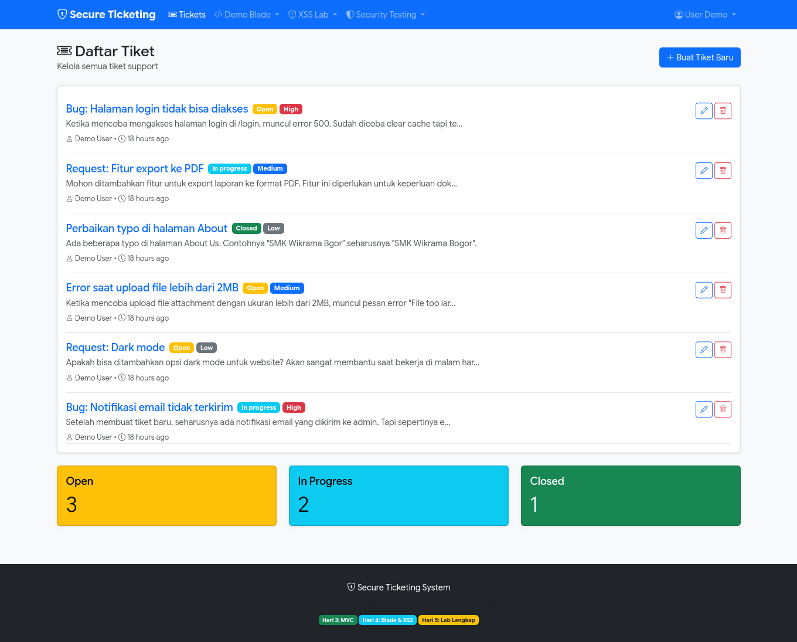
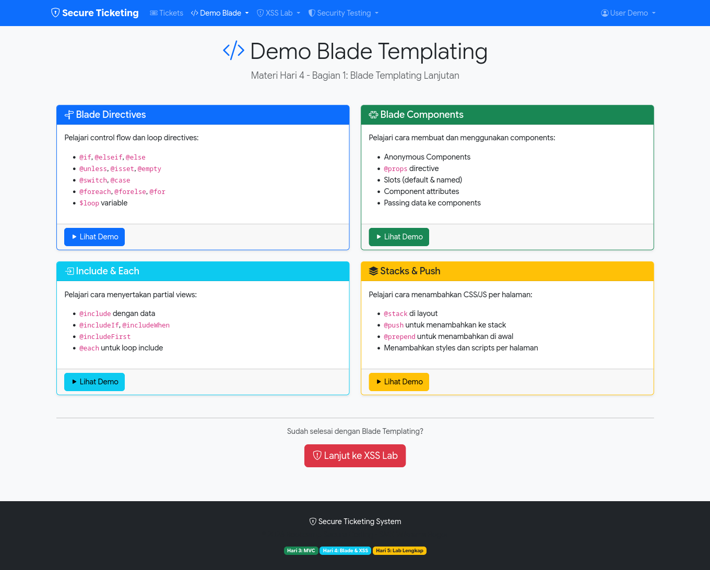
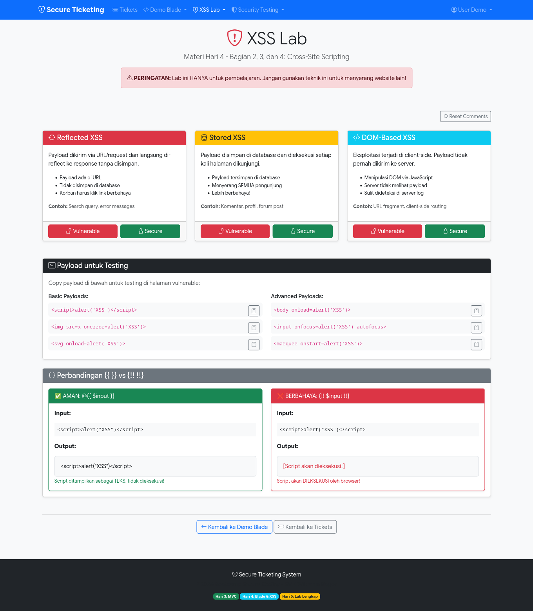
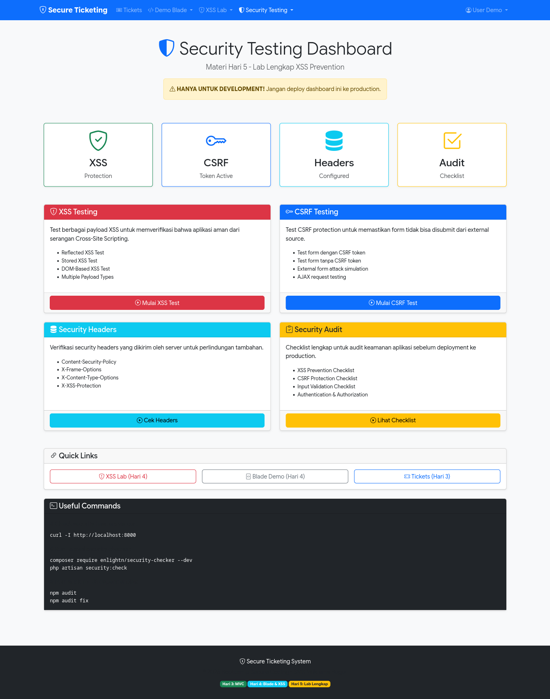

# 🎫 Secure Ticketing System

<p align="center">
  
</p>

<p align="center">
  
  
  
  
</p>

## 📖 Tentang Proyek

**Secure Ticketing** adalah aplikasi sistem tiket dukungan (support ticket) yang dibangun dengan Laravel 12. Proyek ini dirancang sebagai **materi praktikum keamanan web** di SMK Wikrama, mendemonstrasikan:

- ✅ Implementasi sistem tiket lengkap (CRUD)
- ✅ Praktik keamanan web terbaik
- ✅ Lab interaktif untuk mempelajari kerentanan XSS
- ✅ Demo komponen Blade Laravel

## 🖼️ Screenshots

<p align="center">
  
  
</p>

<p align="center">
  
  
</p>

## ✨ Fitur Utama

### 🎫 Sistem Tiket
- Membuat, melihat, mengedit, dan menghapus tiket
- Sistem prioritas (Low, Medium, High)
- Status tiket (Open, In Progress, Closed)
- Komentar pada tiket

### 🔒 Security Testing Lab
- **XSS Lab** - Pelajari kerentanan Cross-Site Scripting:
  - Reflected XSS (Vulnerable vs Secure)
  - Stored XSS (Vulnerable vs Secure)
  - DOM-based XSS (Vulnerable vs Secure)
- **CSRF Testing** - Demonstrasi proteksi CSRF
- **Security Headers** - Analisis header keamanan
- **Security Audit** - Pemeriksaan keamanan aplikasi

### 🎨 Demo Blade
- Components
- Directives
- Includes
- Stacks

## 🛠️ Tech Stack

| Teknologi | Versi |
|-----------|-------|
| PHP | 8.5.2 |
| Laravel Framework | 12.50.0 |
| PostgreSQL | 16+ |
| TailwindCSS | 4.1.18 |
| PHPUnit | 11.5.52 |

## 📋 Persyaratan

- PHP >= 8.4
- Composer
- PostgreSQL >= 14 (atau MySQL >= 8.0)
- Node.js >= 18
- NPM >= 9

## 🚀 Instalasi

1. **Clone repository**
   ```bash
   git clone https://github.com/username/secure-ticketing.git
   cd secure-ticketing
   ```

2. **Install dependencies**
   ```bash
   composer install
   npm install
   ```

3. **Setup environment**
   ```bash
   cp .env.example .env
   php artisan key:generate
   ```

4. **Konfigurasi database** di file `.env`
   ```env
   DB_CONNECTION=pgsql
   DB_HOST=127.0.0.1
   DB_PORT=5432
   DB_DATABASE=secure_ticketing
   DB_USERNAME=postgres
   DB_PASSWORD=your_password
   ```

5. **Jalankan migration**
   ```bash
   php artisan migrate
   ```

6. **Build assets**
   ```bash
   npm run build
   ```

7. **Jalankan server**
   ```bash
   php artisan serve
   ```

8. Buka browser dan akses `http://localhost:8000`

## 📁 Struktur Proyek

```
secure-ticketing/
├── app/
│   ├── Http/Controllers/
│   │   ├── TicketController.php
│   │   ├── CommentController.php
│   │   ├── SecurityTestController.php
│   │   ├── XSSLabController.php
│   │   └── DemoBladeController.php
│   └── Models/
│       ├── User.php
│       ├── Ticket.php
│       └── Comment.php
├── database/
│   ├── migrations/
│   └── seeders/
├── resources/views/
├── routes/
│   └── web.php
├── tests/
└── docs/
    └── screenshots/     ← Simpan screenshot di sini
```

## 🧪 Testing

Jalankan test suite:
```bash
php artisan test
```

Jalankan test dengan coverage:
```bash
php artisan test --coverage
```

## 📚 Dokumentasi Praktikum

### XSS Lab

Lab XSS menyediakan lingkungan aman untuk mempelajari kerentanan Cross-Site Scripting:

| Tipe XSS | Deskripsi |
|----------|-----------|
| **Reflected** | Input langsung ditampilkan tanpa sanitasi |
| **Stored** | Input disimpan di database dan ditampilkan ke user lain |
| **DOM-based** | Manipulasi DOM melalui JavaScript |

> ⚠️ **Peringatan:** Lab ini hanya untuk tujuan edukasi. Jangan gunakan teknik ini pada sistem tanpa izin.

## 🤝 Kontribusi

1. Fork repository
2. Buat branch fitur (`git checkout -b fitur/FiturBaru`)
3. Commit perubahan (`git commit -m 'Menambah FiturBaru'`)
4. Push ke branch (`git push origin fitur/FiturBaru`)
5. Buat Pull Request

## 📄 Lisensi

Proyek ini dilisensikan di bawah [MIT License](LICENSE).

## 👨‍🏫 Kredit

Dibuat untuk praktikum keamanan web di **SMK Wikrama**.

---

<p align="center">
  Made with ❤️ using Laravel
</p>
